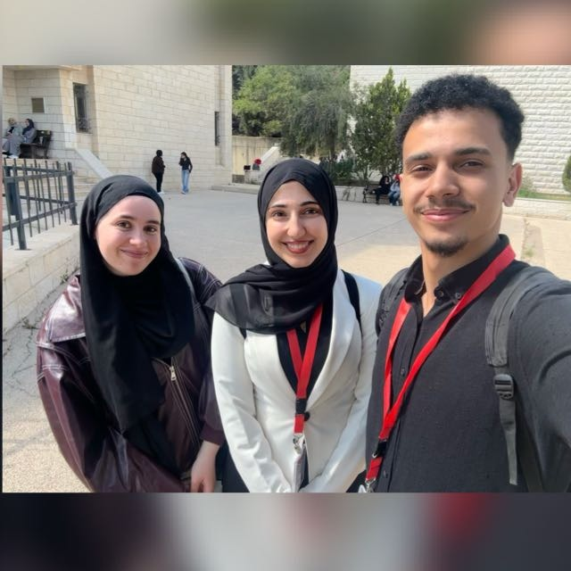
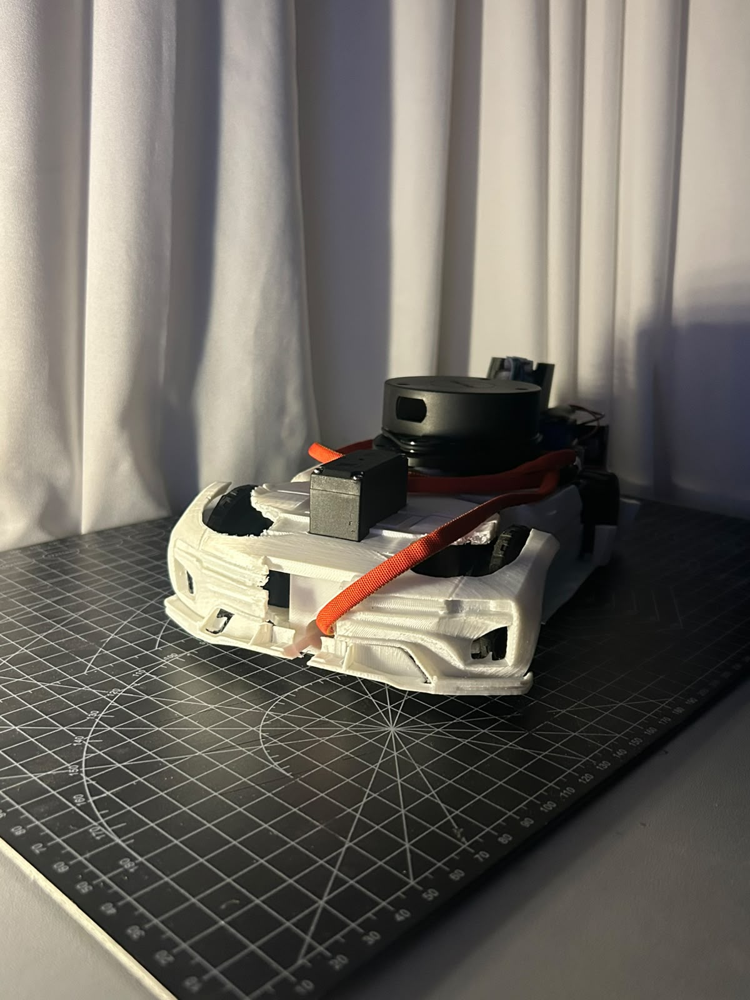
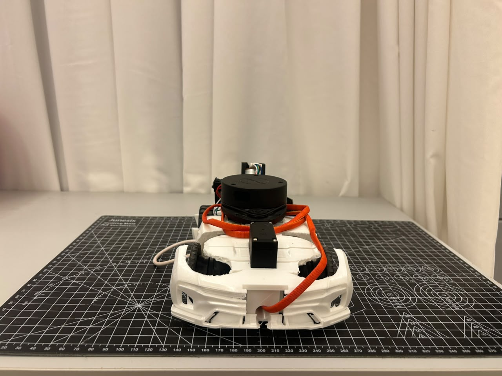
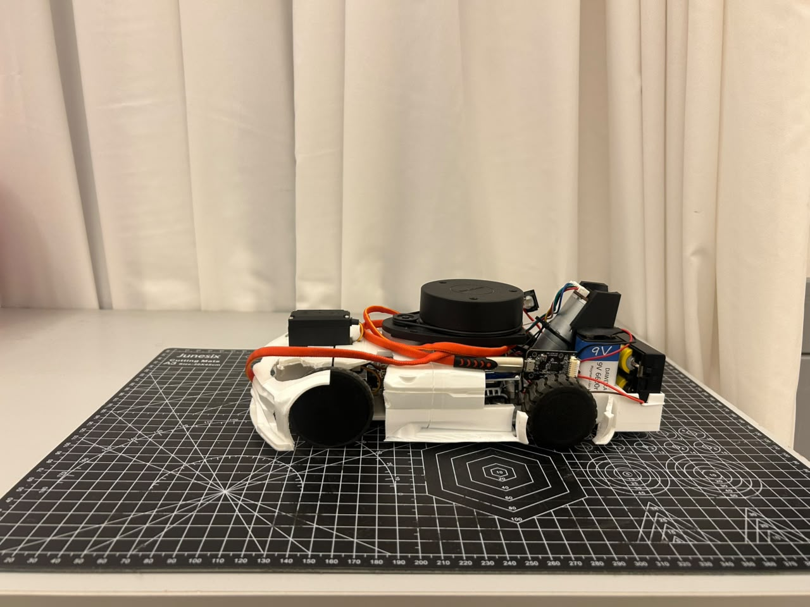
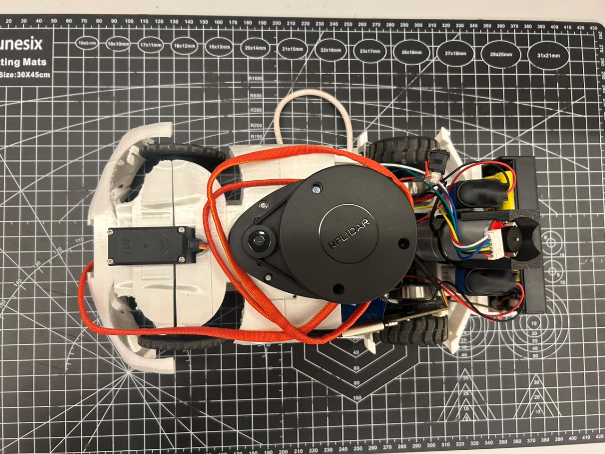
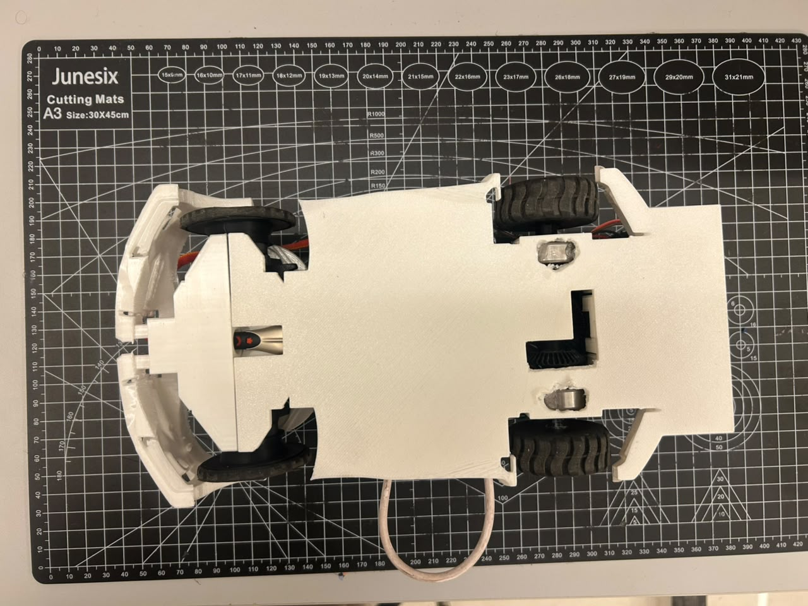
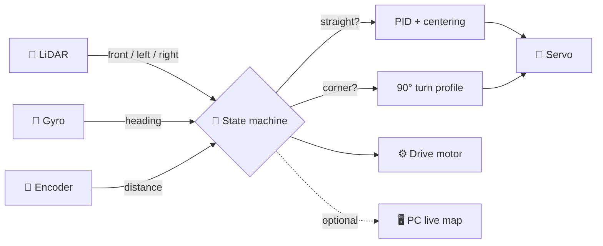
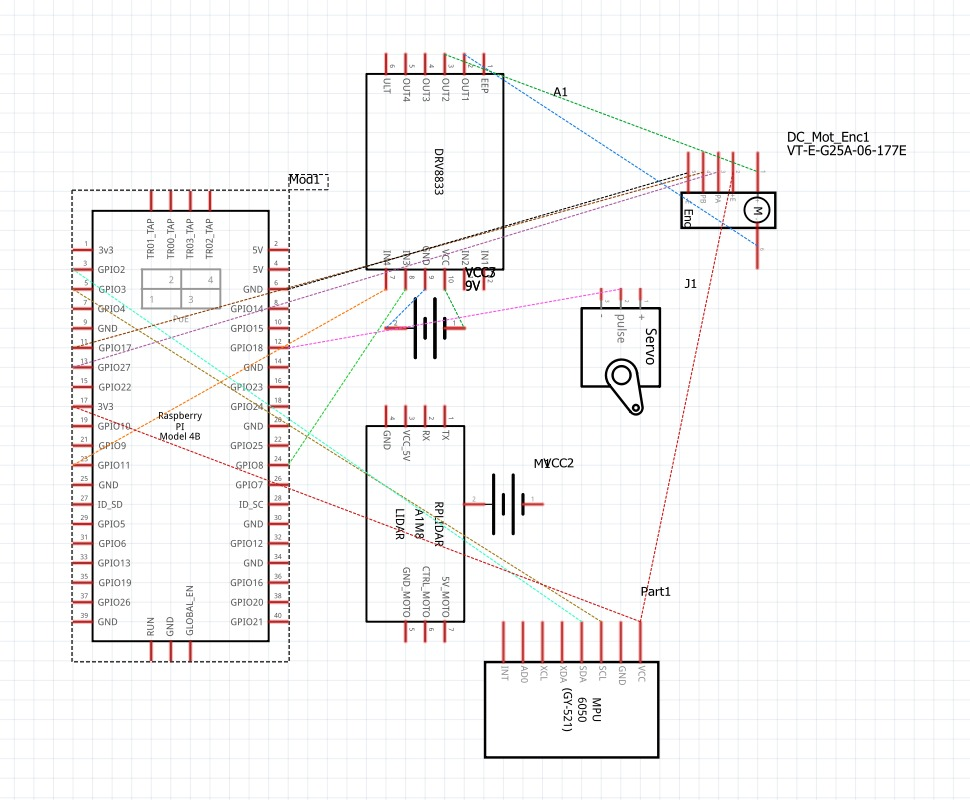
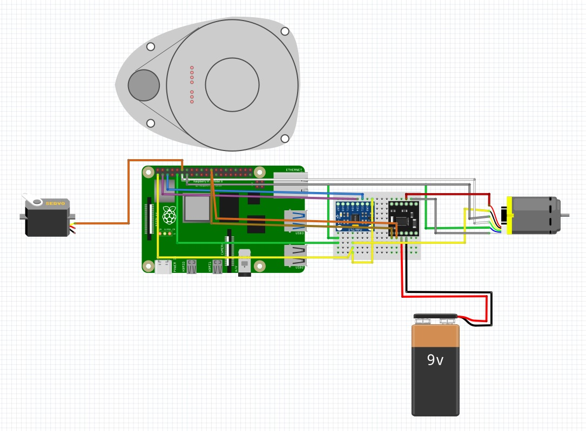
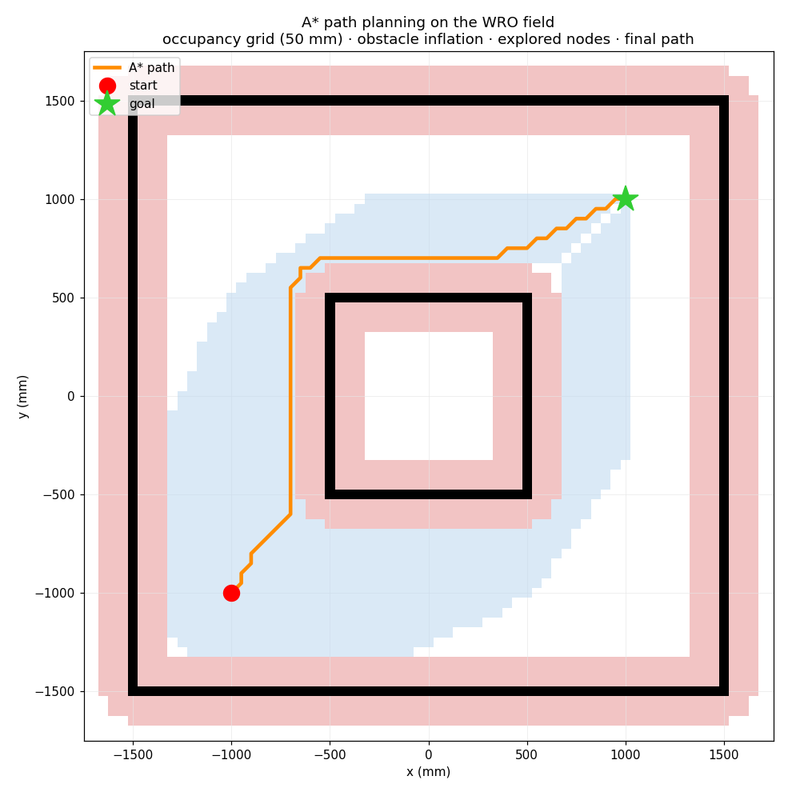

<div align="center">

# 🤖 RoboTeamBZU — WRO Future Engineers 2026

### Self-driving model car · LiDAR + Gyro + Encoder · Raspberry Pi 4

**Team:** RoboTeamBZU · Birzeit University · 🇵🇸 Palestine
**Members:** Bashar Ibrahim · Jinan Yousef · Basmala Assi






<sub>⬆️ add your hero photo as <code>v-photos/hero.jpg</code> — see the image guide below</sub>

</div>

---

## 🚗 What is this?

A small **autonomous car** that drives itself around the WRO Future Engineers track. It has **no remote control** — it senses the walls, keeps itself centered, turns at each corner, counts its laps, and stops on its own.

```
        👀 SEE                🧠 THINK                🦿 ACT
   ┌───────────────┐    ┌──────────────────┐    ┌──────────────┐
   │ LiDAR  (walls)│    │  state machine   │    │ servo (steer)│
   │ Gyro   (turn) │──► │  + PID heading   │──► │ motor (drive)│
   │ Encoder(dist) │    │  + LiDAR centering│   │              │
   └───────────────┘    └──────────────────┘    └──────────────┘
```

### 📸 The vehicle

| Front | Side | Top | Bottom |
|:---:|:---:|:---:|:---:|
|  |  |  |  |

<sub>All six angles live in [`/v-photos`](./v-photos). See the image guide at the bottom for filenames.</sub>

---

## ⭐ Highlights

| | |
|---|---|
| 🧭 **Gyro-guided** | Heading held by a PID loop on the MPU6050 gyro |
| 📡 **LiDAR-centered** | RPLidar keeps the car in the middle of the lane and spots corners |
| 📏 **Dead reckoning** | Encoder + gyro track position with **no GPS** |
| 🔌 **Brownout-proof power** | 3 isolated battery sources + single star ground |
| 🖥️ **Live map** | Streams a real-time 2D/2.5D map + telemetry to a PC over Wi-Fi |
| 🔁 **Fully autonomous** | Drives with **zero** network — telemetry is optional |

---

## 🧩 How it works (30-second version)



1. **Go straight** — the gyro holds a fixed heading; the LiDAR nudges left/right to stay centered.
2. **See a wall ahead** (< 600 mm, confirmed 3×) — turn 90° toward the open side.
3. **Repeat** for **3 laps** (1080° total), then stop.
4. The turn direction (CW/CCW) is **auto-detected** at the first corner, because WRO randomizes it.

Full detail → [Software Architecture](./docs/Software-Architecture.md).

---

## 🛠️ The build at a glance

```
            ┌─────────────────────────────┐
   TOP DECK │  🍓 Pi 4   📡 LiDAR   🧭 IMU │   ← clear 360° LiDAR sweep
            └───────────────┬─────────────┘
                            │ 4× standoffs (rigid)
            ┌───────────────┴─────────────┐
   LOW DECK │ 🦿 servo   ⚙️ motor+encoder  │   ← heavy batteries kept low
            │        🔋🔋🔋 power          │
            └─────────────────────────────┘
             front (steered)      rear (driven)
```

| Subsystem | Choice | Why |
|---|---|---|
| **Drive** | 1× brushed DC motor, rear axle, DRV8833 | simple, car-like; kick-pulse launch fixes stall |
| **Steering** | servo + Ackermann, ±60° | predictable turn radius, decoupled from drive |
| **Heading** | MPU6050 gyro (Z axis) | smooth, high-rate, independent of walls |
| **Distance** | rotary encoder (205 counts/rev) | measured + tape-checked odometry |
| **Ranging** | RPLidar A1M8 | 360° walls; centering + corner detection |
| **Compute** | Raspberry Pi 4 | runs all flight code in Python |
| **Power** | 3 isolated sources, star ground | kills the brownouts a shared battery caused |

Deep dives → [Mechanical Design](./docs/Mechanical-Design.md) · [Power & Sensor Architecture](./docs/Power-and-Sensor-Architecture.md)

### 🔌 Wiring

| Schematic | Wiring diagram |
|:---:|:---:|
|  |  |

<sub>Full pin map: [`other/pinout.md`](./other/pinout.md) · architecture notes: [`/schemes`](./schemes)</sub>

---

## 📂 Repository map

```
RoboTeam2026/
├── 📄 README.md                ← you are here
├── 📁 docs/                    ← the four engineering write-ups
│   ├── Mechanical-Design.md            (🔧 rubric 1)
│   ├── Power-and-Sensor-Architecture.md (⚡ rubric 2)
│   ├── Software-Architecture.md        (💻 rubric 3)
│   ├── Systems-Engineering.md          (🧠 rubric 4)
│   ├── Build-and-Setup.md              (🛠️ how to reproduce)
│   └── Engineering-Journal-PDF.md
├── 📁 src/                     ← all Python code
│   ├── wro_open.py             (Open Challenge autonomy)
│   ├── robot_mapper.py         (odometry + LiDAR mapping)
│   ├── map_viewer*.py          (PC live map / telemetry)
│   └── tests/                  (per-module bring-up scripts)
├── 📁 engineering-journal/     ← V1 → V2 → V3 → Final story
├── 📁 models/                  ← CAD + STL (AutoCAD/, STL/)
├── 📁 schemes/                 ← wiring diagram
├── 📁 other/                   ← BOM, pinout, test procedure
├── 📁 v-photos/                ← 6 vehicle photos
├── 📁 t-photos/                ← team photos
└── 📁 video/                   ← performance video links
```

---

## 🚀 Quick start

**On the Raspberry Pi (autonomous run):**
```bash
sudo pigpiod                       # hardware-PWM daemon (jitter-free servo)
python3 src/wro_open.py            # Open Challenge — ENTER to arm, CTRL+C to stop
python3 src/grid_goto.py           # Obstacle Challenge — A* map navigation
```

**On a PC (optional live map — start this first):**
```bash
pip install numpy matplotlib pyvista
python3 src/map_viewer_pro.py      # telemetry HUD + 2.5D map
```

Full setup, dependencies, and troubleshooting → [Build & Setup](./docs/Build-and-Setup.md).

---

## 🎯 The two challenges

| Challenge | What the car must do | How | Status |
|---|---|---|---|
| 🟢 **Open Challenge** | 3 laps of a walled track, staying centered | reactive state machine: gyro PID + LiDAR centering | ✅ [`src/wro_open.py`](./src/wro_open.py) |
| 🟠 **Obstacle Challenge** | detect red/green signs, pass on the correct side, park | **live map + A\*** planner + camera color + "virtual walls" | ✅ [`src/grid_goto.py`](./src/grid_goto.py) |

**Two different brains for two problems.** The Open Challenge is *reactive* (follow the walls). The Obstacle Challenge is *deliberative*: the car builds a 50 mm occupancy grid, treats each traffic sign as a one-sided "virtual wall," and runs **A\* pathfinding** to a goal — re-planning several times a second as it discovers the track.



<sub>A\* routing the car around the inner wall — black = walls, pink = safety margin, blue = cells the search explored, orange = chosen path. Full write-up → [Software Architecture §6](./docs/Software-Architecture.md#6-obstacle-challenge-strategy--srcgrid_gotopy).</sub>

---

## 🧪 Engineering approach

We built the car in **four iterations**, each one a full *design → build → test → learn* loop:

```
V1 ──────► V2 ──────► V3 ──────► FINAL
baseline   clean       steady      repeatable
car        sensing     control     3-lap runs
```

- **V1** — car drives under gyro PID, but wanders and stalls.
- **V2** — LiDAR moved up + power split → clean scans, no brownouts.
- **V3** — hardware-PWM servo + kick pulse → no jitter, reliable launch.
- **Final** — start-line recalibration, centering smoothing, wind-up fix → consistent runs.

Read the full story → [Engineering Journal](./engineering-journal) · Trade-offs & risk analysis → [Systems Engineering](./docs/Systems-Engineering.md)

---

## 📚 Documentation index

| Doc | Covers | Rubric |
|---|---|---|
| [🔧 Mechanical Design](./docs/Mechanical-Design.md) | chassis, drive, steering, torque/speed | 1 |
| [⚡ Power & Sensor Architecture](./docs/Power-and-Sensor-Architecture.md) | power budget, wiring, sensors, calibration | 2 |
| [💻 Software Architecture](./docs/Software-Architecture.md) | state machine, PID, obstacle strategy | 3 |
| [🧠 Systems Engineering](./docs/Systems-Engineering.md) | interactions, trade-offs, iteration, risk | 4 |
| [🛠️ Build & Setup](./docs/Build-and-Setup.md) | reproduce & run the vehicle | 5 |
| [🧾 BOM](./other/BOM.md) · [🔌 Pinout](./other/pinout.md) · [✅ Test Procedure](./other/test-procedure.md) | parts, pins, validation | 5 |

---

## 🖼️ Image guide (drop your photos in with these names)

The README references these files. Add each image to the folder with the exact filename and it renders automatically:

| Save as | Which photo |
|---|---|
| `v-photos/hero.jpg` | best-looking shot of the car (the sunlit one) |
| `v-photos/front.jpg` · `back.jpg` · `left.jpg` · `right.jpg` · `top.jpg` · `bottom.jpg` | the six required vehicle angles |
| `t-photos/team-photo.jpg` | official team photo (the three of you) |
| `t-photos/team-fun.jpg` | fun team photo |
| `schemes/schematic.jpg` | the pin/schematic diagram |
| `schemes/wiring.jpg` | the Fritzing wiring diagram |

✅ All photos, diagrams, and component images are in place. Optional extra: a second fun team photo as `t-photos/team-fun.jpg`.

---

<div align="center">

**RoboTeamBZU · Birzeit University · 🇵🇸 Palestine**
Bashar Ibrahim · Jinan Yousef · Basmala Assi

Built with 🍓 Raspberry Pi, 📡 LiDAR, and a lot of 🔁 iteration.

</div>
