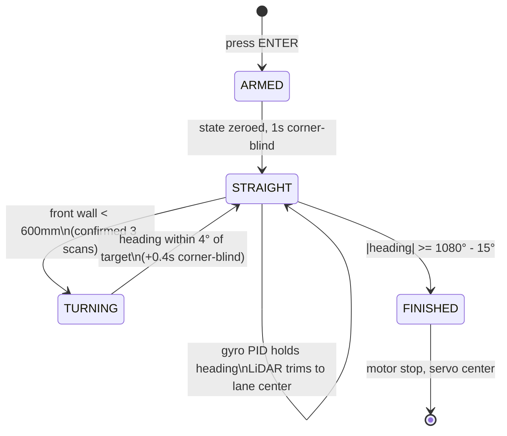

# 💻 Software Architecture & Obstacle Strategy

> **Rubric criterion 3 — Software Architecture & Obstacle Strategy.** This document explains the code structure, the state machine, the control algorithms (PID, dead reckoning, LiDAR logic), how edge cases are handled, and how the software was tuned and validated. Source lives in [`/src`](../src).

---

## 1. Code map

All flight code runs on the **Raspberry Pi 4**; the `map_viewer*` scripts run on a **PC** on the same Wi-Fi and receive telemetry over UDP.

| File | Runs on | Purpose |
|---|---|---|
| [`src/wro_open.py`](../src/wro_open.py) | Pi | **Open Challenge** — state-machine navigation (gyro PID + LiDAR centering/corners) with telemetry streaming |
| [`src/grid_goto.py`](../src/grid_goto.py) | Pi | **Obstacle Challenge** — live occupancy grid + A\* planner + camera sign detection + virtual-wall avoidance |
| [`src/robot_mapper.py`](../src/robot_mapper.py) | Pi | Standalone odometry + LiDAR world-mapping streamer (mapping tests without driving logic) |
| [`src/map_viewer.py`](../src/map_viewer.py) | PC | 2D top-down live map (matplotlib) |
| [`src/map_viewer_3d.py`](../src/map_viewer_3d.py) | PC | 2.5D live map (pyvista), walls extruded to real 100 mm height |
| [`src/map_viewer_pro.py`](../src/map_viewer_pro.py) | PC | 2.5D map + full telemetry HUD, chase camera, textured floor |
| [`src/grid_viewer.py`](../src/grid_viewer.py) | PC | Live **occupancy-grid** viewer for the Obstacle Challenge: black cells, A\* path/corridor, pillars, virtual walls, robot arrow (click a cell to read its coordinates) |
| [`src/sim/field_astar_demo.py`](../src/sim/field_astar_demo.py) | PC | Offline A\* illustration on a simulated WRO field (generates the figure below) |
| [`src/tests/`](../src/tests) | Pi | Per-module bring-up & calibration scripts |

**Design philosophy:** small, single-responsibility modules. Sensing, pose estimation, control, and telemetry are separate functions so any one can be tested or retuned in isolation. That modularity is why each hardware module has its own test script (see [`other/test-procedure.md`](../other/test-procedure.md)).

---

## 2. The Open Challenge state machine

The Open Challenge is three laps of a walled track (no obstacles). The vehicle must stay centered, take corners, and stop after **3 laps = 1080° of cumulative heading**.



| State | What it does |
|---|---|
| **ARMED** | On ENTER, all state is zeroed (heading, encoder, PID terms) and a 1 s "corner-blind" window prevents a false corner at the start line. |
| **STRAIGHT** | Gyro PID holds the snapped target heading (0/90/180/270…). LiDAR left/right distances trim the target to keep the car centered in the lane. Watches the front window for a corner. |
| **TURNING** | Full-lock steering toward `snapped + 90°·turn_dir`, easing off as it approaches. Drive slows to `SPEED_TURN`. |
| **FINISHED** | After 1080° cumulative heading, stop motor and center steering. |

**Turn direction is auto-detected** at the first corner (WRO randomizes CW/CCW): whichever side reads as the open corridor (`> 900 mm`) sets `turn_dir` for the whole run.

---

## 3. Control algorithms

### 3.1 Heading hold — PID on the straights
`pid_steer()` in [`wro_open.py`](../src/wro_open.py) runs a PID controller on heading error (`target − heading`):

| Gain | Value | Role |
|---|---|---|
| `KP` | 0.9 | Proportional — main corrective push |
| `KI` | 0.05 | Integral — removes steady drift (clamped ±30 to stop wind-up) |
| `KD` | 0.15 | Derivative — damps oscillation (low-pass filtered, `KD_FILTER = 0.3`) |

Integral is **reset when exiting a turn** so wind-up from the corner isn't carried into the next straight — a deliberate edge-case fix.

### 3.2 Lane centering — LiDAR trim
On straights, `smoothed_center_error(left, right)` averages the last 4 scans of `(left − right)`. Within a 30 mm deadzone the trim is zero; otherwise the target heading is nudged by up to ±6° (`CENTER_GAIN`, `CENTER_TRIM_MAX`) to steer back to the lane center. Smoothing prevents single noisy scans from jerking the wheel.

### 3.3 Corner detection & turn profile
- **Trigger:** front wall closer than `TURN_TRIGGER_DIST = 600 mm`, confirmed over `TURN_CONFIRM = 3` consecutive scans (debounce against a single bad reading).
- **Profile:** `turn_steer()` holds full lock (`55°`) until within `TURN_RELEASE_DEG = 25°` of the target, then ramps down linearly for a clean exit within `TURN_EXIT_TOL = 4°`.

### 3.4 Pose estimation — dead reckoning
`update_pose()` fuses **gyro (heading)** and **encoder (distance)** each loop:
```
heading += gyro_z * dt          # integrated yaw rate
x += Δdistance * cos(heading)   # advance along heading
y += Δdistance * sin(heading)
```
This pose drives the live map and telemetry. LiDAR points are transformed into world coordinates and streamed to the PC viewers.

---

## 4. Edge cases handled

| Edge case | Handling |
|---|---|
| False corner at start line | 1 s `START_BLIND` window after ARM |
| Double-trigger right after a turn | 0.4 s `POST_TURN_BLIND` window |
| Single noisy LiDAR scan | 3-scan confirm + 4-scan centering smoothing |
| PID wind-up through corners | integral clamped and reset on turn exit |
| Motor stall from rest | kick pulse (full power for 0.15 s) |
| Gyro thermal drift | warm-up + re-calibration at start line |
| LiDAR stale stream on reconnect | `stop()` + `reset()` at startup |
| Network hiccup | telemetry send wrapped in try/except; tracking continues |

---

## 5. Tuning & validation

Every module was validated in isolation before integration ([`other/test-procedure.md`](../other/test-procedure.md)):

1. **Servo** — sweep test; jitter fixed with hardware PWM.
2. **Gyro** (`test_gyro.py`) — verified 90°/360° physical rotations; measured drift.
3. **Motor** (`test_motor.py`) — direction + ramp; stall fix verified.
4. **Encoder** (`test_encoder.py`, `test_distance.py`) — 205 counts/rev, cross-checked at 500 mm.
5. **LiDAR** (`test_lidar_pi.py`) — four-direction distances vs. tape measure.
6. **Turning** (`test_turn.py`) — closed-loop turns to absolute headings.
7. **Mapping** — pushed-lap test: walls form closed straight lines and the trail returns to origin, validating dead reckoning **before** any autonomous run.

**Metric used to validate the map/odometry:** after a hand-pushed loop, the trail must return to the origin and walls must close into straight lines — a direct visual check that encoder + gyro drift is within tolerance.

---

## 6. Obstacle Challenge strategy — [`src/grid_goto.py`](../src/grid_goto.py)

The Obstacle Challenge replaces "follow the walls" with **"know where you are and plan a path."** Instead of a reactive state machine, the car builds a **live map** and runs an **A\* planner** to a goal cell, re-planning several times a second as the map fills in. Traffic signs (pillars) become geometry the planner must respect.

### 6.1 The big idea: occupancy grid + A\*
```mermaid
flowchart TD
    L[📡 LiDAR scan] --> G[50 mm occupancy grid\nfree / occupied / unknown]
    P[🧭 Gyro + 📏 Encoder] --> POSE[Pose x,y,h]
    POSE --> G
    CAM[📷 Pi Camera] --> PIL[Pillar color RED/GREEN]
    L --> PIL
    PIL --> VW[Virtual walls\non the forbidden side]
    G --> ASTAR{A* planner}
    VW --> ASTAR
    ASTAR --> WP[Waypoint follower\npure-pursuit steering]
    WP --> DRIVE[Servo + motor]
    ASTAR -.replan every 0.5s.-> ASTAR
```

- **The world is a grid of 50 mm cells** (`GRID_RESOLUTION_MM = 50`). The car starts at cell `(0,0)`, heading 0.
- Each LiDAR ray marks cells **free** along its length and **occupied** at its endpoint, using a confidence count (`OCC_CONFIRM = 3`) so one noisy scan can't create a phantom wall (`update_grid`, `occupied_cells`).
- **Unknown cells are treated as free** (optimistic planning): the car assumes open space and **re-plans every `REPLAN_S = 0.5 s`** as reality is revealed — this is what lets it start driving before it has seen the whole track.

#### How A\* finds the route


*The exact `astar()` from [`grid_goto.py`](../src/grid_goto.py), run offline on a simulated WRO field ([`src/sim/field_astar_demo.py`](../src/sim/field_astar_demo.py)). Black = real walls, pink = obstacle-inflation no-go zone, blue = cells A\* explored, orange = the final path.*

A\* is a best-first search that finds the **shortest collision-free path** from the robot's cell to the goal cell. For each candidate cell it keeps a score `f = g + h`:

- **`g`** — the real distance travelled from the start to that cell (straight moves cost `1.0`, diagonals `1.414`).
- **`h`** — a *heuristic* estimate of the distance still to go, here the straight-line (Euclidean) distance to the goal. Because `h` never over-estimates, A\* is guaranteed to return the shortest path.

It always expands the lowest-`f` cell next, which is why the blue "explored" region fans out *toward* the goal instead of searching everywhere — A\* is far cheaper than flooding the whole grid. Key implementation details in our version:

1. **Obstacle inflation** — every wall cell is grown by the robot's radius (`OBSTACLE_INFLATION_MM = 130 mm`, the pink band) so the *center* of the car can follow the path without a corner clipping a wall.
2. **Diagonal corner-cutting is blocked** — a diagonal move is only allowed if both orthogonal neighbours are free, so the path never squeezes through a wall's corner.
3. **Escape bubble** — the cells around the start are force-cleared so a car that starts hemmed against a wall can always plan its way out.
4. **Path simplification** — `simplify()` collapses the raw cell staircase into the fewest straight segments that stay collision-free, giving the smooth orange line the pure-pursuit follower actually drives.

In the figure the planner routes the car out of the bottom-left lane, **around the inner wall**, and into the top-right — exactly the reasoning it performs live, several times a second, as new walls and pillars appear.

### 6.2 Traffic signs → "virtual walls"
This is the core avoidance trick. A red pillar must be passed on one side, a green pillar on the other. Rather than special-casing steering, we turn each rule into **geometry the planner obeys** (`pillar_constraints`):

| Sign | Rule | What the code does |
|---|---|---|
| 🔴 **RED** | pass on the pillar's **right** | builds a **virtual wall** extending to the **left** of the approach line |
| 🟢 **GREEN** | pass on the pillar's **left** | builds a virtual wall extending to the **right** |

The virtual wall is a thin line of blocked cells on the forbidden side, plus an **L-shaped cap** forward from its tip so A\* can't sneak around the end through unknown-as-free space. The result: **A\* has exactly one legal way past each sign**, and steering falls out of the plan automatically. Passed pillars are culled (`_along(t) > -400`) so they never constrain the car again.

### 6.3 Detecting the signs (sensor fusion: LiDAR + camera)
1. **LiDAR finds candidates** (`find_pillars`): points inside a forward cone (`PILLAR_CONE_DEG = 40°`) are clustered; a cluster only counts as a pillar if it is **small** (`CLUSTER_MAX_SPAN ≤ 120 mm`) and **isolated** from the walls behind it (`isolated()` depth check). This rejects walls and corners.
2. **Camera reads the color** (`get_color`): the Pi Camera frame is converted to HSV and the region of interest **at the pillar's bearing** is sampled. Red uses two HSV ranges (the hue wraps at 0/180); the color with more pixels wins, above a `COLOR_MIN_PIXELS = 150` threshold. If no camera is present, a fallback alternates RED/GREEN for bench testing.
3. **Tracking** (`update_tracks`): detections are matched frame-to-frame in world coordinates and only promoted to a real pillar after `PILLAR_CONFIRM = 3` consistent hits — debouncing false positives before they ever affect the plan.

### 6.4 Following the plan
- **Pure-pursuit steering:** the follower aims at a **lookahead point** `LOOKAHEAD_MM = 210` along the path and steers with a proportional law (`HEAD_KP = 1.1`), interpolating between waypoints for a smooth line.
- **Closed-loop speed:** a PI controller (`SPD_KP`, `SPD_KI`) holds a target ground speed measured from pose deltas, slowing to `TARGET_MMS_TURNY = 180 mm/s` when the heading error is large and running `300 mm/s` on straights.
- **Path simplification:** `simplify()` collapses the A\* cell path into the fewest straight segments that stay collision-free, so the car drives smooth lines instead of a staircase.

### 6.5 Getting unstuck (edge cases)
| Situation | Detection | Recovery |
|---|---|---|
| Wall dead ahead | `front < EMERGENCY_STOP_MM (130)` | reverse `STUCK_REV_MM` then re-plan (`reverse_out` → recursive `goto_cell`) |
| Not moving but commanded to | `meas_mms < STALL_MMS` for `STUCK_S = 1.2 s` | reverse + re-plan |
| Motor won't launch | speed near zero | **kick pulse** (full power `0.15 s`), forward or reverse |
| Goal sits inside a wall zone | `nearest_free()` | nudge the goal to the closest free cell (`GOAL_SEARCH_R = 6`) |
| Robot starts hemmed in | — | A\* carves an escape bubble around the start cell |
| LiDAR stream dies | exception in scan thread | auto `stop()`+`reset()` and reconnect |

### 6.6 Safety & workflow details
- **Idle thread** keeps pose + map updating while the program waits at the target prompt, so the map is live and `dt` never goes stale between goals.
- **`flush_pose()`** discards odometry accumulated while idle (e.g. if the robot was handled), so stale motion never integrates into the pose.
- **Pre-start preview:** before arming, the viewer shows a raw LiDAR preview so the team can confirm the track outline; on ENTER the gyro is calibrated (600 samples, warm chip) and the real map starts clean.
- Everything streams to **`grid_viewer.py`** on the PC: occupied cells, planned path, goal, tracked pillars, and the virtual walls — so runs can be debugged visually.

> **Parking:** the same A\* + goal-cell mechanism drives the parallel-parking approach — the parking bay is simply a goal cell, with the surrounding geometry blocked so the planner threads the car in. (Parking-specific tuning is being finalized.)

### 6.7 Calibration note — two tuned configs
The Obstacle Challenge program is tuned as its **own configuration** and differs from the Open Challenge on a few constants. If you rebuild, use the values matching the program you run:

| Constant | `wro_open.py` | `grid_goto.py` |
|---|---|---|
| `COUNTS_PER_REV` | 205 | 165 |
| `WHEEL_D_MM` | 44.0 | 45.0 |
| `SERVO_MAX` | 60 | 50 |
| `GYRO_DIRECTION` | −1 | +1 |
| `MOTOR_IN1, IN2` | 23, 24 | 24, 23 |
| Camera | not used | Pi Camera (color) |

> ⚠️ These reflect re-calibration between build stages. Keep each script's header block as the source of truth for the config it was tuned with.

---

## 7. Reproducibility
- All source: [`/src`](../src) with a [README](../src/README.md) explaining each file
- Calibrated constants are defined at the top of each script and in [`other/pinout.md`](../other/pinout.md)
- Dependencies (Pi): `adafruit-circuitpython-mpu6050`, `rplidar-roboticia`, `gpiozero`, `pigpio` (built from source, `pigpiod` running)
- Dependencies (PC viewers): `numpy`, `matplotlib`, `pyvista`
