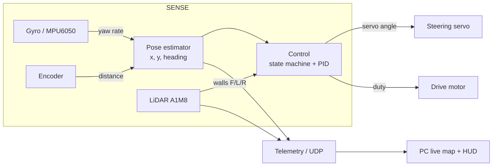

# 🧠 Systems Thinking & Engineering Decisions

> **Rubric criterion 4 — Systems Thinking & Engineering Decisions.** This document shows *how the subsystems work together*, the constraints and trade-offs behind each major decision, the iteration cycles, and the risk analysis. Where the other docs answer "what" and "how," this one answers **"why we chose X instead of Y."**

---

## 1. The system as a whole

The vehicle is four subsystems that only work because of how they hand data to each other:

**Interaction that matters most:** heading is owned by the gyro, distance by the encoder, and lane position/corner timing by the LiDAR — three *independent* information sources. If they were entangled (e.g. using LiDAR for heading too), one bad sensor could corrupt everything. Keeping them separate makes each failure local and diagnosable.

---

## 2. Key decisions: "why X instead of Y"

| Decision | We chose… | Instead of… | Why (data / reasoning) |
|---|---|---|---|
| Heading source | **Gyro integration** | LiDAR wall-angle estimation | Gyro gives a smooth, high-rate heading independent of wall geometry; LiDAR angle is noisy near corners. Trade-off accepted: gyro drifts, so we re-calibrate at the start line. |
| Steering | **Servo Ackermann** | Differential/skid steer | Predictable turn radius, decouples drive from steering, simpler control. |
| Power | **3 isolated sources + star ground** | Single shared battery | Shared battery caused Pi brownouts and I²C errors under motor load. Isolation fixed it. |
| Servo PWM | **Hardware PWM (pigpio)** | Software PWM | Software PWM jittered the steering; hardware PWM is rock-steady. |
| LiDAR orientation | **Remap angles in code** | Re-machine the mount | Cheaper, faster, zero mechanical risk — a software `LIDAR_MOUNT_OFFSET`. |
| Corner trigger | **Front distance + 3-scan confirm** | Single-scan threshold | Debounces false triggers from one noisy scan. |
| Start-from-rest | **Kick pulse in software** | Bigger/geared motor | Solves stall without adding weight or cost; kept as a safety margin. |
| Motor speed | **Slow to 55% in turns** | Constant speed | Constant speed caused understeer and inconsistent turn radius. |

---

## 3. Constraints we designed around

| Constraint | Impact on design |
|---|---|
| **Gyro drifts (~1°/3 s, thermal)** | Warm-up + start-line recalibration; deadzone to reject noise |
| **LiDAR needs clear 360° sweep** | LiDAR mounted at the highest point on a two-deck chassis |
| **Motor/servo current is noisy** | Isolated power rails, star ground, servo return off the Pi ground |
| **Pi is brownout-sensitive** | Dedicated 2S Li-ion + buck to 5.1 V just for the Pi |
| **WRO randomizes turn direction** | Direction auto-detected at the first corner, not hard-coded |
| **Standstill torque limited** | Kick-pulse launch; low-friction drivetrain |
| **Small arena, tight corners** | Slow-in/steady-out turn profile with full-lock steering |

---

## 4. Iteration cycles

Each version was a full **design → build → test → learn** loop. Details and photos in the [engineering journal](../engineering-journal).

| Version | Problem found | Change made | Result |
|---|---|---|---|
| **V1** | Baseline car ran but wandered and stalled | Established platform, first PID | Drives, but not centered or reliable |
| **V2** | LiDAR caught its own chassis; brownouts | Raised LiDAR to top deck; split power rails | Clean scans, no more Pi resets |
| **V3** | Steering jitter; motor stall from rest | Hardware PWM servo; kick pulse | Steady steering, reliable launch |
| **Final** | Heading drift into straights; wind-up | Start-line recalibration; reset integral on turn exit; centering smoothing | Repeatable 3-lap runs |

---

## 5. Risk analysis & mitigation

| Risk | Likelihood | Effect | Mitigation |
|---|---|---|---|
| Gyro drift accumulates over 3 laps | Medium | Heading target wrong → clips walls | Warm-up + recalibrate at start; low deadzone |
| Single bad LiDAR scan triggers false turn | Medium | Turns early → crash | 3-scan confirm + blind windows after start/turn |
| Motor fails to launch from rest | Low | DNF at start | Kick pulse; low-friction drivetrain verified |
| Pi brownout under motor stall | Was high → now low | Reboot mid-run → DNF | Isolated Pi power rail |
| PID wind-up after a corner | Medium | Overshoot into next straight | Clamp + reset integral on turn exit |
| Wi-Fi/telemetry drop | Low | Lose live map (not control) | Telemetry is best-effort; control loop never blocks on network |
| LiDAR stale-stream on reconnect | Low | No range data | `stop()`+`reset()` at startup |

**Failure-point philosophy:** telemetry, mapping, and the PC viewers are all *non-critical* — the car drives fully autonomously with zero network. This was a deliberate decision so a Wi-Fi issue at the venue can never cause a DNF.

---

## 6. What we would do next
- Fuse LiDAR into a light SLAM correction to bound gyro drift over long runs.
- Add the Obstacle Challenge vision pipeline (see [Software Architecture](./Software-Architecture.md)).
- Log runs to disk for offline tuning instead of live-only telemetry.

---

## 7. Reproducibility
Every decision above is traceable to code constants ([`src/`](../src)), the pinout ([`other/pinout.md`](../other/pinout.md)), the test log ([`other/test-procedure.md`](../other/test-procedure.md)), and the versioned [engineering journal](../engineering-journal).
