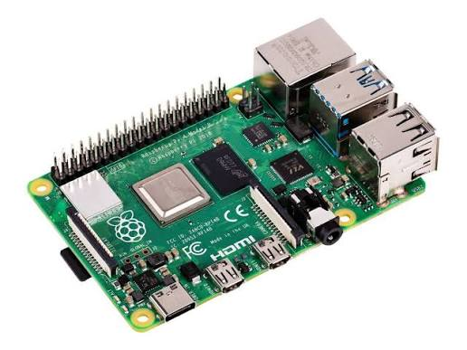
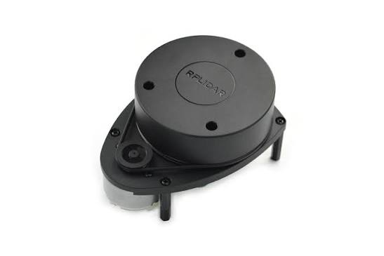
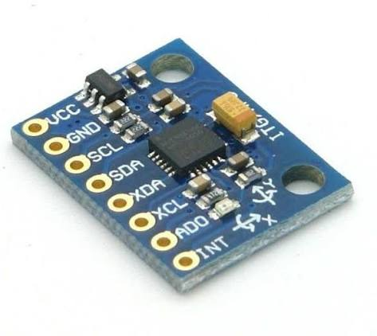
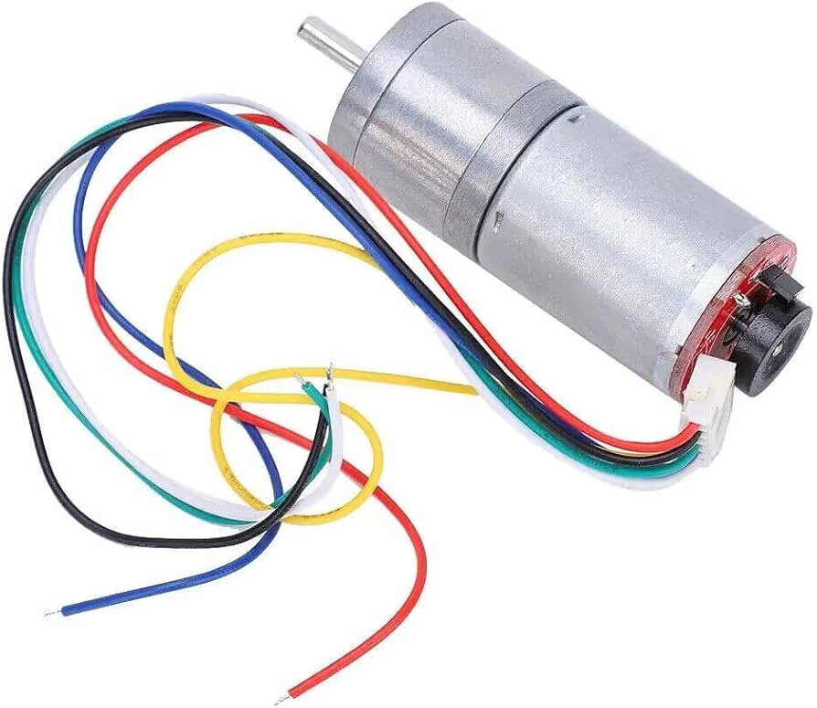
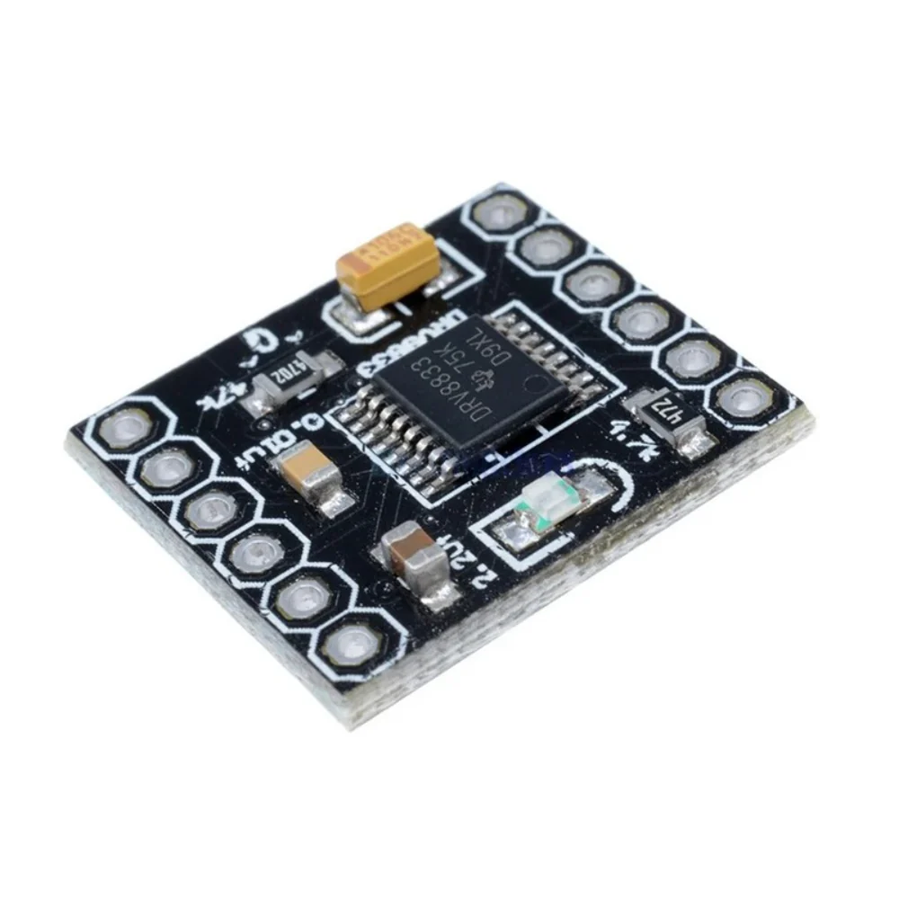
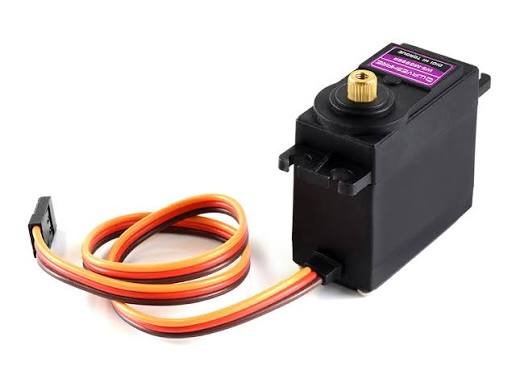
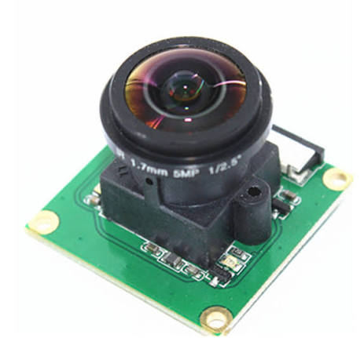
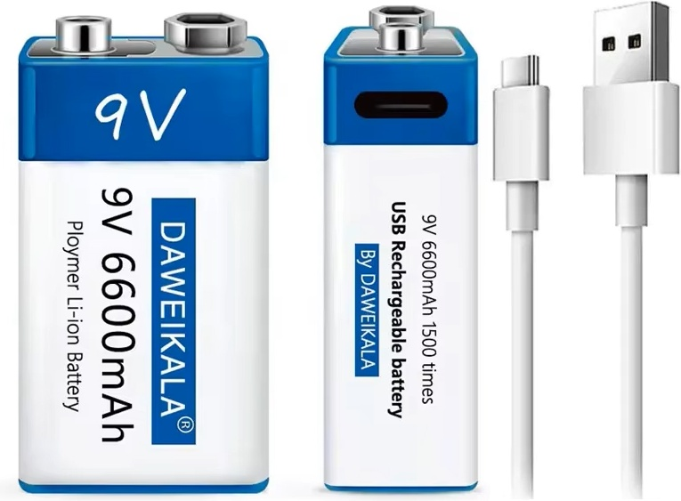
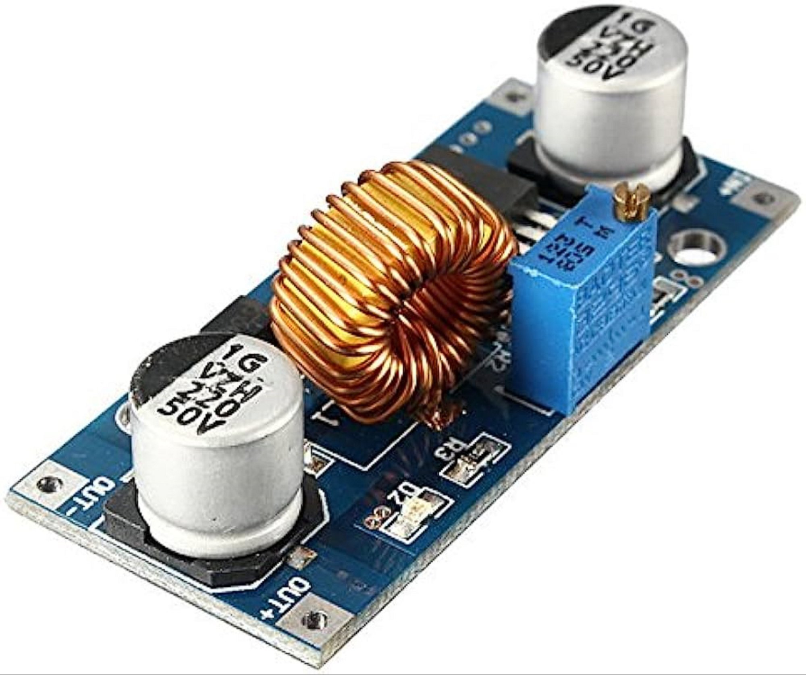
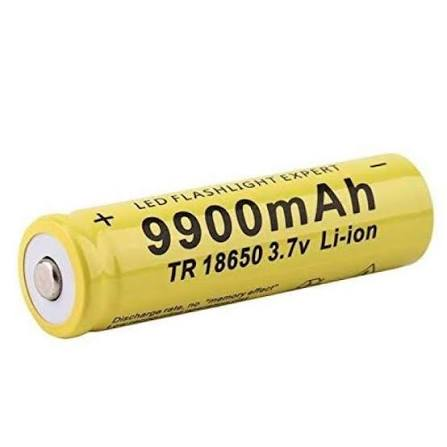

# 🧾 Bill of Materials

All components used to build the vehicle. Quantities are per vehicle. Fill the **Qty / Notes / Source** columns with your actual purchase details before submission.

## Compute & sensing

| # | Component | Exact part | Qty | Interface | Notes |
|---|---|---|---|---|---|
| 1 | Single-board computer | **Raspberry Pi 4 Model B** | 1 | — | runs all flight code |
| 2 | 2D LiDAR | **Slamtec RPLidar A1M8** | 1 | USB `/dev/ttyUSB0` @115200 | 360° sweep; mounted 180° rotated |
| 3 | IMU | **MPU6050 (GY-521 board)** | 1 | I²C (GPIO2/3) | Z-gyro = heading source |
| 4 | Motor w/ encoder | **VT-E-G25A-06-177E** 25 mm DC gearmotor + quadrature encoder | 1 | GPIO17/27 (enc) | odometry — 205 c/rev (open) · 165 c/rev (obstacle) |
| 5 | Camera | **5 MP 175° fisheye CSI camera** (OV5647, 1.7 mm lens, 1/2.5") | 1 | CSI ribbon | Obstacle Challenge: red/green sign color |

## Actuation

| # | Component | Exact part | Qty | Interface | Notes |
|---|---|---|---|---|---|
| 6 | Motor driver | **DRV8833 dual H-bridge** | 1 | GPIO23/24 | drives the gearmotor (item 4); VM from 9 V rail |
| 7 | Steering servo | **MG996R** metal-gear servo | 1 | GPIO18 (hardware PWM) | Ackermann linkage; range ±60° (open) / ±50° (obstacle) |

## Power

| # | Component | Exact part | Qty | Feeds | Notes |
|---|---|---|---|---|---|
| 8 | 9 V Li-ion battery | **DAWEIKALA 9 V 6600 mAh USB-C rechargeable** | 1 | Drive motor (DRV8833 VM) | via power switch |
| 9 | 9 V Li-ion battery | **DAWEIKALA 9 V 6600 mAh USB-C rechargeable** | 1 | Servo (via XL4015 buck) | isolated from logic |
| 10 | Buck converter | **XL4015 5 A adjustable step-down** | 1 | Servo VCC → 5.0 V | — |
| 11 | 18650 Li-ion cells | **3.7 V 18650 (2S = 7.4 V pack)** | 2 | Pi (via buck) | dedicated logic supply |
| 12 | Buck converter | 5 V USB-C step-down | 1 | Raspberry Pi → 5.1 V | brownout-proof Pi rail |
| 13 | Power switch | rocker/slide switch | 1 | motor rail | main arm switch |

> Three isolated sources joined at one **star ground**. See [`other/pinout.md`](./pinout.md) and [`/schemes`](../schemes).

## Chassis & hardware

| # | Component | Spec | Qty | Notes |
|---|---|---|---|---|
| 14 | Chassis / body | 3D-printed (2-deck), scale-car shell | 1 set | see [`/models`](../models) CAD/STL |
| 15 | Standoffs | metal | 4 | join decks rigidly |
| 16 | Wheels | rubber, ~44 mm dia | 4 | rear driven · front steered |
| 17 | Wiring, connectors, star-ground point | — | — | see [`/schemes`](../schemes) |

## Component photos

| | | |
|:---:|:---:|:---:|
|  **Raspberry Pi 4** |  **RPLidar A1M8** |  **MPU6050 (GY-521)** |
|  **Gearmotor + encoder** |  **DRV8833 driver** |  **MG996R servo** |
|  **Fisheye CSI camera** |  **9V USB-C Li-ion** |  **XL4015 buck** |
|  **18650 cell (2S)** | | |

## Software / firmware

| Item | Where |
|---|---|
| Flight & viewer code | [`/src`](../src) |
| Pinout & calibrated constants | [`other/pinout.md`](./pinout.md) |
| Wiring diagram | [`/schemes`](../schemes) |

> 💡 Reproducibility tip: pair this BOM with the calibrated constants in [`pinout.md`](./pinout.md) and the CAD in [`/models`](../models) so another team can rebuild the vehicle exactly.
